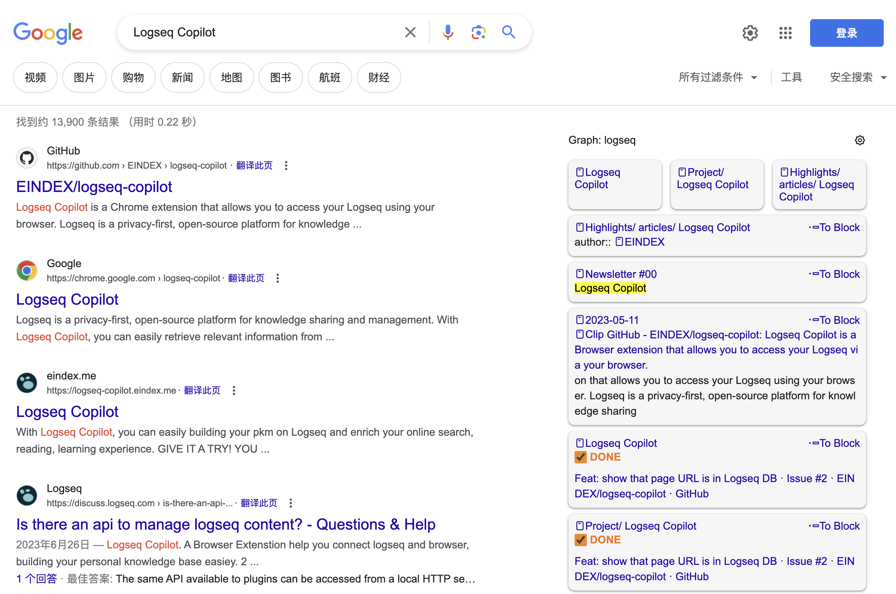

# Logseq Copilot 🚀

**The project is in the early stage of development, and the current version is only a prototype.**

Logseq Copilot is a Chrome extension that allows you to access your Logseq using your browser. Logseq is a privacy-first, open-source platform for knowledge sharing and management. With Logseq Copilot, you can easily retrieve relevant information from your Logseq graph and enrich your online search, reading, learning experience. 🧠

## Features

- Show Logseq blocks when you search on Google via your keywords.🔍

## Screenshot

## Usage

- To use Logseq Copilot, you need to connect it with your Logseq graph first. You can do this by clicking on the extension icon and choosing one of the following options: ⚙️
- enable your logseq api server.
- After connecting your Logseq graph with the extension, you can start searching on Google and see your Logseq blocks on the search page. You can also change the settings of the extension by clicking on the extension icon and going to the `Settings` tab. You can adjust the following settings: 🛠️
  - Number of blocks: The maximum number of blocks to display on the search page. 🔢
  - Position: The position of the extension on the search page. You can choose to show it on the left, right, or bottom of the page. 📐
  - Theme: The color theme of the extension. You can choose between light and dark themes. 🎨

## Roadmap

- CI/CD: Set up a continuous integration and delivery pipeline for the extension development and deployment. 🚦
- Support other search engines: Extend the functionality of the extension to other popular search engines, such as Bing, DuckDuckGo, and Baidu. 🌎
- Style enhancement: Improve the appearance and usability of the extension interface and the blocks display. 💅
- Enhance search ranking for better blocks: Implement a more sophisticated algorithm for ranking the blocks based on their relevance to the search query and the user preferences. 📊
- Query enhance to recall more blocks: Implement a more flexible and powerful query system for retrieving the blocks from the Logseq graph, such as using natural language or advanced operators. 🗣️
- Browser new tab page queries: Add an option to show Logseq blocks on the browser's new tab page based on predefined or random queries. 🆕

_Welcoming more ideas._

## Contributing

Logseq Copilot is an open-source project and welcomes contributions from anyone who is interested in improving it. If you want to contribute, please follow these steps: 🙌

- Fork this repository and clone it to your local machine. 🍴
- Create a new branch for your feature or bug fix. 🌿
- Make your changes and commit them with a clear and concise message.

## Support

## Star History

## License
GPLv3
