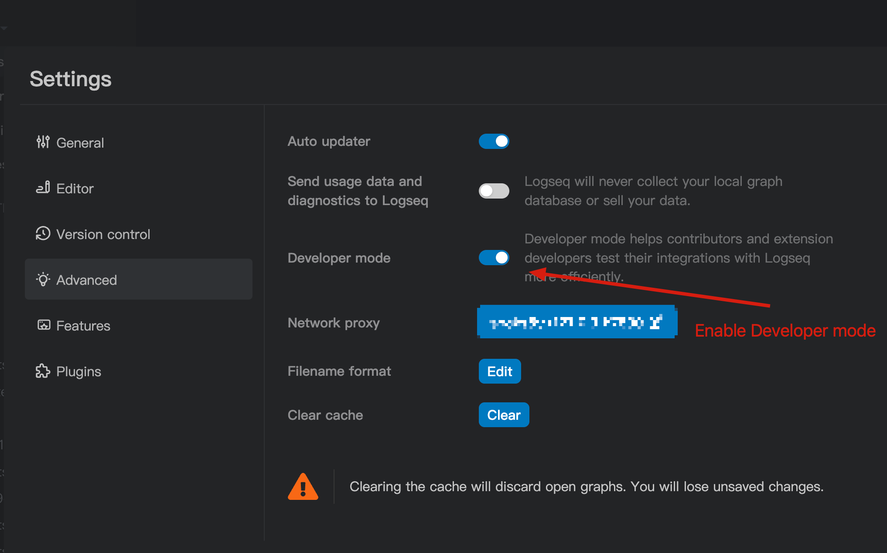

# Logseq Copilot 🚀

  

**The project is in the early stage of development, and the current version is only a prototype.**

Logseq Copilot is a Chrome extension that allows you to access your Logseq using your browser. Logseq is a privacy-first, open-source platform for knowledge sharing and management. With Logseq Copilot, you can easily retrieve relevant information from your Logseq graph and enrich your online search, reading, learning experience. 🧠

## Features

- Show Logseq blocks when you search on Google via your keywords.🔍

## Screenshot

## Usage

How to use this extension, Please follow below steps:

**Making sure your using Logseq which version above 0.8.17**

1. Enable the `Developer mode` in Logseq:

   1. Open `Logseq`.
   2. Settings -> Advanced -> Enable `Developer mode`
      

2. Setup your Logeq API server:

   1. Start server
      
   2. Setting Authorization tokens, for security reason, highly recommend setting this, If you want to connect with logseq copilot, must to setting this up.
      
   3. (Optional) Enable auto start server when Logseq lunched.
      

3. Install this extension. Now this extenstion is under review by chrome extenstions store and edge add-ons. So you can go to [release page](https://github.com/EINDEX/logseq-copilot/releases) download it.

4. Go to Options page to setting the connection.
   If you setting correct, you will see a message show on your Logseq and options page will show connected.

5. You can use Logseq Copilot now!!

## Roadmap

-[x] CI/CD: Set up a continuous integration and delivery pipeline for the extension development and deployment. 🚦

- Support other search engines: Extend the functionality of the extension to other popular search engines, such as Bing, DuckDuckGo, and Baidu. 🌎
- Style enhancement: Improve the appearance and usability of the extension interface and the blocks display. 💅
- Enhance search ranking for better blocks: Implement a more sophisticated algorithm for ranking the blocks based on their relevance to the search query and the user preferences. 📊
- Query enhance to recall more blocks: Implement a more flexible and powerful query system for retrieving the blocks from the Logseq graph, such as using natural language or advanced operators. 🗣️
- Browser new tab page queries: Add an option to show Logseq blocks on the browser's new tab page based on predefined or random queries. 🆕

_Welcoming more ideas._

## Contributing

Logseq Copilot is an open-source project and welcomes contributions from anyone who is interested in improving it. If you want to contribute, please follow these steps: 🙌

- Fork this repository and clone it to your local machine. 🍴
- Create a new branch for your feature or bug fix. 🌿
- Make your changes and commit them with a clear and concise message.

## Support

## Star History

## License

GPLv3
