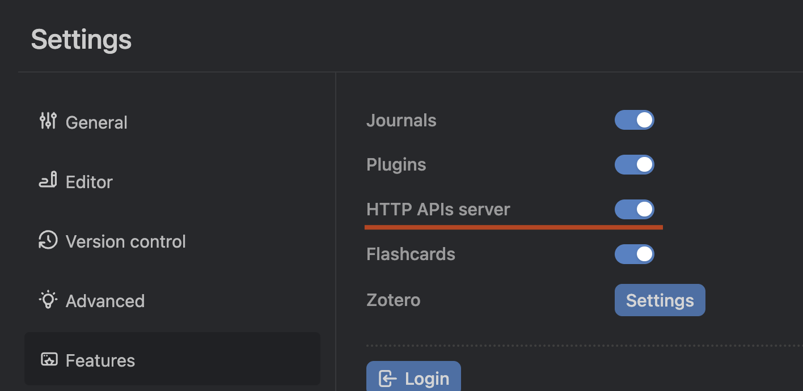
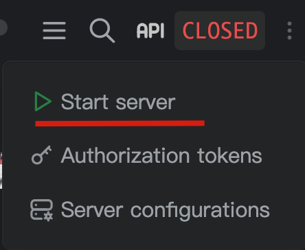
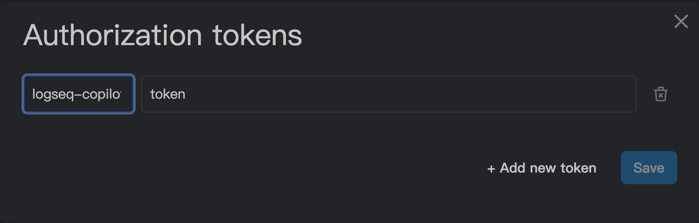
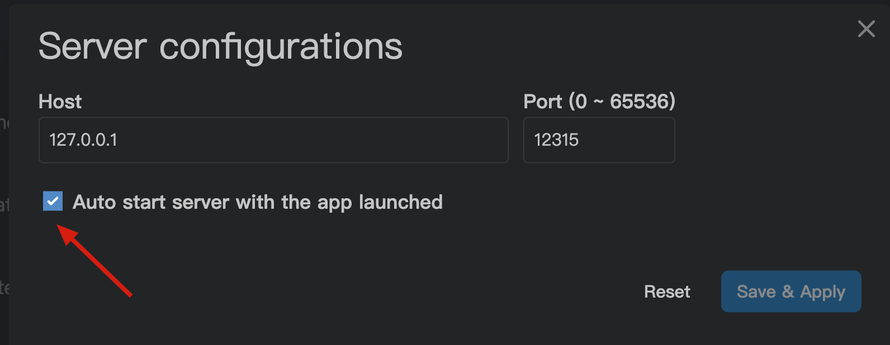
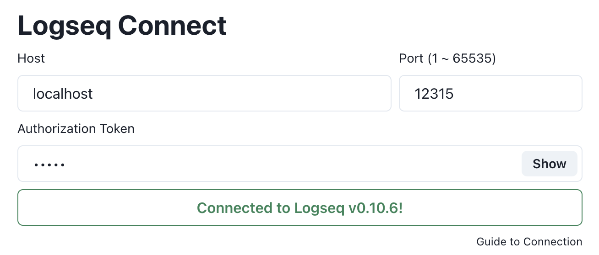

# Logseq Copilot 🚀

  

  <!-- TypeScript Badge -->
  

  

  

  

Logseq Copilot is a Chrome extension that allows you to access your Logseq using your browser. Logseq is a privacy-first, open-source platform for knowledge sharing and management. With Logseq Copilot, you can easily retrieve relevant information from your Logseq graph and enrich your online search, reading, and learning experience. 🧠

## Features

- 🔍 Show Logseq content when you search on popular search engines via your keywords. Now support Google, Bing, Ecosia, Baidu, Yandex, DuckDuckGo, SearX.

## Support

   
  

## Screenshot

## Usage

How to use this extension, please follow the below steps:

**Make sure you're using Logseq which version above 0.8.18**

1. Setup your Logeq API server:
   1. Settings -> Features -> Enable `HTTP APIs Server`

      

   2. Start server

      

   3. Setting Authorization token, for security reasons, highly recommend setting this, If you want to connect with Logseq copilot, must set this up.

      **PS:** `Authorization token` is a secret string, you can set it as a random string you like.
      
      

   4. Enable auto-start server when Logseq open.

      

2. Install extension. 
   - Store version(**Recommend**): [Chrome](https://chrome.google.com/webstore/detail/logseq-copilot/hihgfcgbmnbomabfdbajlbpnacndeihl), [Edge](https://microsoftedge.microsoft.com/addons/detail/logseq-copilot/ebigopegbohijaikegebaaboaomaifoi), [Firefox](https://addons.mozilla.org/en-US/firefox/addon/logseq-copilot/)
   - Newest Version [release page](https://github.com/EINDEX/logseq-copilot/releases) download it and load it as unpacked.

3. Go to Options page to set the connection.
   If you're setting it correctly, you will see a message show on your Logseq and options page will show connected.
   And your `Authorization token` will be used here agian.
   

4. You can use Logseq Copilot now!!

## Roadmap

- [x] 🚦 CI/CD: Set up a continuous integration and delivery pipeline for the extension development and deployment. 🚦

- [x] 🔍 Support other search engines: Extend the functionality of the extension to other popular search engines, such as Bing, DuckDuckGo, and Baidu. 
- [x] 💅 Style enhancement: Improve the appearance and usability of the extension interface and the blocks display.
- [x] 🌐 Support Firefox.
- [x] 🆕 Browser new tab page queries: Add an option to show Logseq blocks on the browser's new tab page based on predefined or random queries. 
- [ ] QuickCapture & advance quick capture, easy and fast making note in Logseq.

- ~~Enhance search ranking for better blocks: Implement a more sophisticated algorithm for ranking the blocks based on their relevance to the search query and the user preferences. 📊~~ Now this feature depends on Logseq Searching API
- ~~Query enhance to recall more blocks: Implement a more flexible and powerful query system for retrieving the blocks from the Logseq graph, such as using natural language or advanced operators. 🗣️~~ Now this feature depends on Logseq Searching API

_Welcoming more ideas._

## Contributing

Logseq Copilot is an open-source project and welcomes contributions from anyone who is interested in improving it. If you want to contribute, please follow these steps: 🙌

- Fork this repository and clone it to your local machine. 🍴
- Create a new branch for your feature or bug fix. 🌿
- Make your changes and commit them with a clear and concise message.

## Credits

- [Logseq](https://logseq.com)
- [chatGPT4Google](https://github.com/wong2/chatgpt-google-extension)

## Star History

## License

GPLv3
